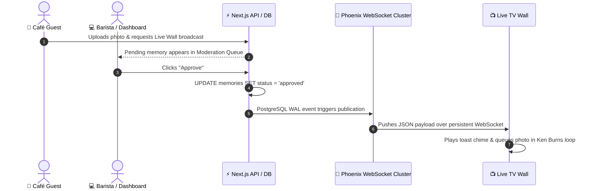

# System Architecture Specification — Café Memories SaaS

**Architecture Classification:** Multi-Tenant Edge-Distributed Reactive Cloud SaaS  
**Target Concurrency:** 10,000 Concurrent WebSocket Clients | 5,000 HTTP Requests/Second  
**Target User Capacity:** 1,000,000+ Registered Users | 100,000 DAU  

---

## 1. High-Level Architecture Topology

```
┌─────────────────────────────────────────────────────────────────────────────────┐
│                           GLOBAL CLIENT INGRESS TIER                            │
├────────────────────┬────────────────────┬───────────────────┬───────────────────┤
│ 📱 Customer Mobile │ 📺 Live TV Wall    │ 💻 Merchant Portal │ ⚙️ Admin Console   │
│ Responsive PWA     │ 4K Ultra-HD WebApp │ Desktop/Tablet UI │ Management Ops    │
│ Route: /c/[slug]   │ Route: /wall/[id]  │ Route: /dashboard │ Route: /admin     │
└─────────┬──────────┴─────────┬──────────┴─────────┬─────────┴─────────┬─────────┘
          │                    │                    │                   │
          └────────────────────┼────────────────────┴───────────────────┘
                               │ HTTPS / WSS / HTTP/3
                    ┌──────────▼──────────┐
                    │ Vercel Edge Network │
                    │ Global Anycast DNS  │
                    │ TLS 1.3 / DDoS Guard│
                    └──────────┬──────────┘
                               │
            ┌──────────────────┴──────────────────┐
            │                                     │
┌───────────▼─────────────┐             ┌─────────▼─────────────┐
│ Next.js App Router (16) │             │ Next.js Route Engine  │
│ Server Components (RSC) │             │ /api/v1/* Handlers    │
│ React 19 Streaming SSR  │             │ Zod Request Validator │
└───────────┬─────────────┘             └─────────┬─────────────┘
            │                                     │
            └──────────────────┬──────────────────┘
                               │
            ┌──────────────────┴──────────────────┐
            │                                     │
┌───────────▼─────────────┐             ┌─────────▼─────────────┐
│ Supabase Edge Gateway   │             │ Supabase Storage CDN  │
│ PgBouncer Connection    │             │ Global Object Cache   │
│ Pool (Port 6543)        │             │ Edge WebP Resizing    │
└───────────┬─────────────┘             └───────────────────────┘
            │
┌───────────▼─────────────────────────────────────┐
│           POSTGRESQL 15 HIGH-AVAILABILITY       │
│  - Multi-Tenant Row Level Security (RLS)        │
│  - 23 Normalized Domain Tables                  │
│  - Composite B-Tree & Partial Indexes           │
│  - WAL Replication to Realtime Engine           │
└───────────┬─────────────────────────────────────┘
            │ logical replication (wal2json)
┌───────────▼─────────────────────────────────────┐
│        SUPABASE REALTIME ENGINE (ELIXIR)        │
│  - Distributed Phoenix WebSocket Cluster        │
│  - Sub-50ms Global Fan-Out to TV Displays       │
│  - Automatic Heartbeat & State Synchronization  │
└─────────────────────────────────────────────────┘
```

---

## 2. Distributed Runtime & Ingress Topology

### 2.1. Ingress & Routing Layer
- **Global Anycast Network:** Incoming traffic is terminated at the closest Edge Point-of-Presence (PoP) across 300+ global data centers.
- **HTTP/3 & QUIC:** Enabled for low-latency media transfers on mobile cellular connections in crowded cafés.
- **Middleware Execution:** Next.js Edge Middleware intercepts requests in < 5ms to evaluate:
  1. Authentication state via Supabase SSR cookie tokens.
  2. Tenant context resolution from subdomains or route slugs (`cafeSlug` -> `organization_id`).
  3. Distributed sliding-window rate limiting.

### 2.2. Serverless Compute Boundary
- Dynamic API routes (`/api/v1/*`) run on isolated serverless execution environments with warm container re-use.
- Direct database calls leverage transactional connection pooling to avoid connection starvation under load bursts.

---

## 3. Multi-Tenancy & Data Isolation Model

Café Memories implements a **Shared Database, Isolated Row Level Security** architecture. This provides maximum cost efficiency and effortless global analytics while guaranteeing cryptographic data separation between independent café brands.

### 3.1. Tenant Scoping Hierarchy
1. **Platform Level:** Global super-admins.
2. **Organization Level (`organization_id`):** The commercial entity (e.g., "Espresso Lab Global Roasters"). Holds billing, branding, subscription tiers, and global customer directories.
3. **Branch Level (`branch_id`):** The physical coffee shop location (e.g., "Espresso Lab Downtown Branch"). Holds physical QR codes, TV wall screens, barista staff memberships, and localized visit events.

### 3.2. Row Level Security (RLS) Mechanics
Every query executed by merchant dashboards or customer devices runs under PostgreSQL RLS:
```sql
-- Example RLS Policy for Merchant Memories Access
CREATE POLICY "Merchant members can view memories in their organization"
ON memories FOR SELECT
USING (
  organization_id IN (
    SELECT organization_id FROM organization_members
    WHERE user_id = auth.uid()
  )
);
```
RLS policies are executed inside the PostgreSQL query planner, ensuring that even if application code omits an `organization_id` filter, the database engine physically excludes rows belonging to other tenants.

---

## 4. Real-Time WebSocket Engine for Live TV Walls

The Live TV Wall requires low-latency, reliable updates without overwhelming database connection limits.

### 4.1. Event Broadcasting Mechanics
1. A barista or manager clicks "Approve" on a guest memory in the dashboard.
2. An `UPDATE` statement sets `memories.status = 'approved'` and `memories.visibility = 'live_wall'`.
3. PostgreSQL emits a Write-Ahead Log (WAL) event captured by Supabase's `wal2json` replication slot.
4. The Elixir/Phoenix Realtime server parses the event and publishes a broadcast message to the topic:
   `screen:branch:[branch_id]`.
5. Connected Live TV Wall clients receive the JSON payload over a persistent WebSocket connection in < 50ms.
6. The TV frontend smoothly transitions to the new photo with a Ken Burns effect and displays a subtle notification banner.



---

## 5. Media Ingestion & Optimization Pipeline

To support 100,000 daily photo uploads without incurring astronomical storage and bandwidth costs, media undergoes a dual-stage optimization pipeline:

### 5.1. Client-Side Stage (Pre-Flight)
- In-browser HTML5 Canvas downsamples high-resolution smartphone photos (often 12–48 megapixels, 8–15MB) to a maximum dimension of 1920px.
- Strips privacy-sensitive EXIF geolocation and camera serial metadata.
- Compresses output to JPEG/WebP at quality 0.85, shrinking payload by ~85% (average file size: 350KB–600KB) before transmission.

### 5.2. Edge Processing Stage (Sharp Derivatives)
- Edge API validates file headers and magic bytes (`image/jpeg`, `image/png`, `image/webp`).
- Sharp generates two derivatives stored in Supabase Storage:
  - `optimized`: 1080x1080 WebP (quality 82%) for Live Wall projection.
  - `thumbnail`: 320x320 WebP (quality 75%) for mobile stamp card feeds.
- Objects are served through a global CDN with public immutable caching headers (`Cache-Control: public, max-age=31536000, immutable`).

---

## 6. Distributed Caching & Fault Tolerance

| Cache Tier | Storage Layer | TTL | Invalidation Strategy |
|---|---|---|---|
| **QR Code Resolution** | Vercel Edge KV / In-Memory | 10 minutes | Stale-While-Revalidate on branch config updates |
| **Merchant Dashboard Metrics** | Redis / Memory Memoization | 30 seconds | Event-driven invalidation on memory approval/visit creation |
| **Loyalty Reward Rules** | Client LocalStorage + Edge Cache | 1 hour | Versioned cache key invalidated on rule modification |
| **Media Derivatives** | Supabase Storage CDN | 1 year | Immutable content-hashed filenames |
