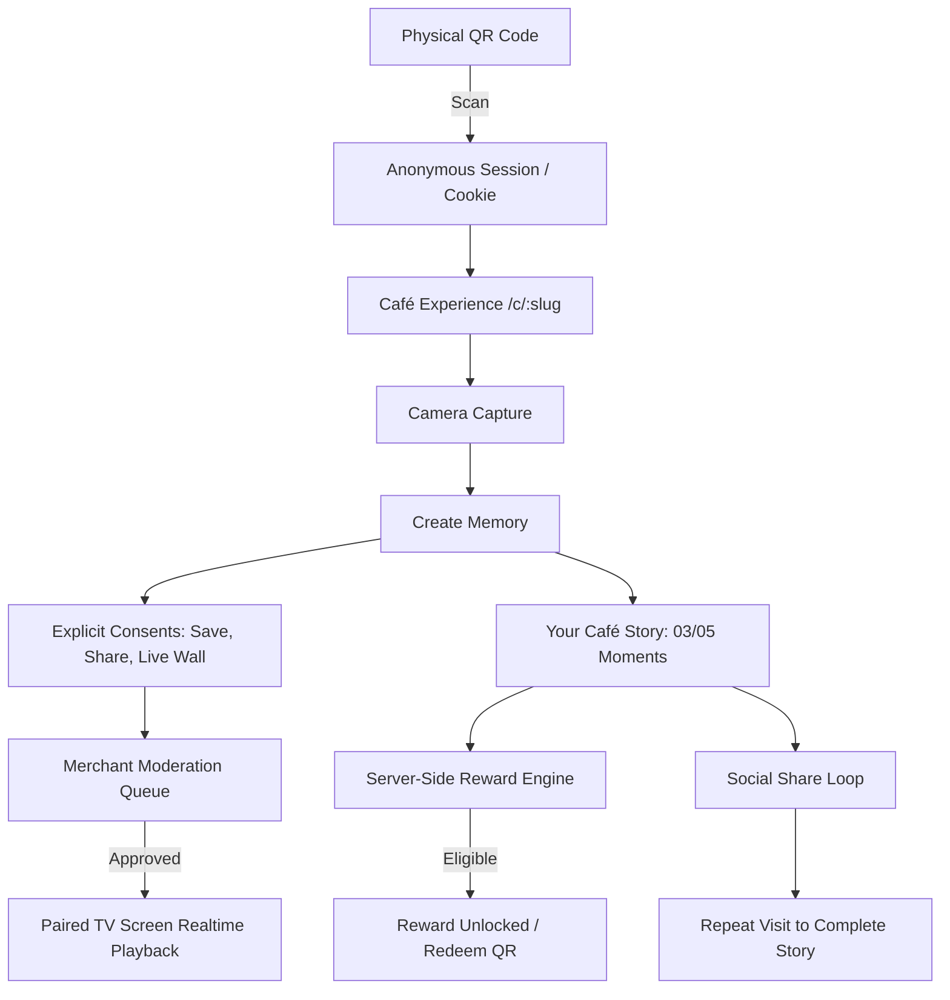

# Codebase & System Audit: Cafe Memories Platform
**Date:** September 2026
**Auditor:** Principal Architecture, Product & Security Team
**Scope:** Full repository (src/, supabase/, docs/, tests/, load-tests/), deployed environment (https://memories-c9w.pages.dev/), and system state.

---

## 1. Executive Summary & Product Misalignment Analysis

The current codebase represents a prototype that suffered a severe **product drift**:
- **What was built:** A digital Korean/Tokyo photobooth simulator with 10 print frames, stickers, filters, photo-cut customization, paper printing logistics, and an intrusive phone-number login upfront.
- **What the product actually is:** **A DIGITAL MEMORY + LOYALTY + SOCIAL + LIVE WALL PLATFORM FOR CAFÉS**.
  - **Core Object:** Memory (customer, org, branch, visit, image derivatives, consents).
  - **Core Outcome:** Returning customers (retention, repeat visits).
  - **Growth Engine:** Social sharing + Physical in-store Live Wall.
  - **Merchant Value:** Retention, customer-generated content (UGC), engagement, operational insights.

The system contains high-quality foundational database schemas and test harnesses, but user-facing client logic and merchant dashboard navigation were hijacked by photobooth mechanics and local storage mocks.

---

## 2. Component & Architecture Inventory

| Subsystem / Component | Current Implementation | Classification | Root Problem / Risk | Action Required |
| :--- | :--- | :--- | :--- | :--- |
| **Landing Page (src/app/page.tsx)** | Heavy emphasis on photobooth frames, Korean Noir, and photo print sizes (5×15.2cm). | **WRONG PRODUCT DIRECTION** | Positioned as photobooth rental/software instead of café memory & loyalty platform. | **REWRITE**: Reposition around Memories, Returning Guests, Live Wall community board, and automated rewards. |
| **Customer Journey (CustomerClient.tsx)** | Asks for phone number immediately upon landing. Renders frame selector, sticker tray, and 4-cut photobooth strip. | **WRONG PRODUCT DIRECTION & MOCK** | High friction; violates frictionless entry; forces identity before value; photobooth UI dominates. | **REBUILD**: Anonymous session by default; frictionless camera capture; 'Your Café Story' collection (3/5 moments); optional Google auth later with history merge. |
| **Merchant Dashboard (src/app/(merchant)/dashboard)** | Tabs: Studio (default), CRM, Loyalty, Print, Wall. Hardcoded sample customers (Sarah, Omar, etc.). | **WRONG PRODUCT DIRECTION & MOCK** | Photobooth control panel mentality. Primary navigation focused on frames/print instead of business retention. | **REBUILD**: Primary nav: Overview (What happened today), Customers, Memories, Live Wall, Rewards, QR Codes, Screens, Campaigns, Analytics. Zero fake data in production. |
| **TV Live Wall (WallClient.tsx)** | Displays corkboard with pins; hardcoded FALLBACK_MEMORIES (Sarah, Ahmed, Maya, Karim) and reads localStorage. | **PARTIAL & HARDCODED** | Not a true paired device screen. Hardcoded mock records displayed in production. | **REBUILD**: Real screen pairing with temporary expiring codes; branch-scoped realtime playback; offline caching; customer fairness algorithm. |
| **Database Schema (00001_initial_schema.sql)** | 23 tables (organizations, branches, customers, memories, visits, reward_events, screens, etc.) with RLS. | **REAL & SOLID FOUNDATION** | Missing transactional reward balance verification function and screen pairing expiration tracking. | **KEEP & EXTEND**: Add atomic redemption procedure, consent revocation triggers, and screen pairing constraints. |
| **API: Memories (api/v1/memories)** | Zod-validated CRUD interacting with Supabase memories and memory_consents. | **REAL & WORTH KEEPING** | Status update PATCH lacks staff/merchant authorization checks. | **HARDEN**: Add proper org/branch member verification on moderation endpoints. |
| **API: Upload (api/v1/memories/upload)** | Sharp WebP derivative generation (1080px display, 320px thumbnail). | **REAL & WORTH KEEPING** | Synchronous compute inside HTTP request. | **KEEP**: Maintain high-quality WebP derivatives for mobile story and Live Wall. |
| **API: Visits (api/v1/visits)** | Evaluates anti-fraud (device cooldown + IP burst velocity) and logs visit to DB. | **REAL / PARTIAL** | Reward calculation uses Date.now() in idempotency keys; relies on client-provided IDs. | **REBUILD**: Server-side resolved customer and branch; true deterministic idempotency keys. |
| **API: Rewards Redeem (api/v1/rewards/redeem)** | Inserts reward_redeemed event after checking idempotency key. | **UNSAFE** | Never checks if the customer has actually accumulated enough verified visits to earn the reward! | **CRITICAL FIX**: Enforce strict server-side eligibility and atomic consumption. |
| **API: Screen Pairing (api/v1/screens/pair)** | Directly inserts whatever screen payload and 6-digit code the client posts. | **UNSAFE / WRONG** | Backwards security model. Merchant must generate temporary expiring code; screen pairs by entering code. | **REBUILD**: Secure two-way pairing handshake with 10-minute expiry and attempt rate limiting. |
| **QR Redirect (app/go/[qrSlug]/route.ts)** | Hardcoded redirect to /c/demo-cafe?ref=... | **HARDCODED** | Ignores database QR lookup and branch slug. | **FIX**: Connect directly to database QR slug resolver. |
| **Settings Services (business-settings.service.ts, customer-registry.service.ts)** | Saves café config and customer records into browser localStorage. | **MOCK / UNNECESSARY** | Causes divergence across devices and bypasses multi-tenant database. | **REMOVE**: Replace with real Supabase database queries and edge-cached configuration. |

---

## 3. Classification Summary

### A. What is REAL & Worth Keeping
1. **PostgreSQL Relational Schema (supabase/migrations/00001_initial_schema.sql)**: High-quality schema with organizations, branches, customers, customer_identities, visits, memories, consents, screens, reward_rules, and RLS policies.
2. **Sharp Image Derivative Pipeline (src/lib/services/images.ts)**: Generates 1080px display and 320px thumbnail WebP files cleanly.
3. **Anti-Fraud Fingerprint & Velocity Engine (src/lib/services/anti-fraud.ts)**: Device cooldown and IP velocity hashing logic is conceptually sound.
4. **Supabase Client / Server / Admin Setup (src/lib/supabase/)**: Properly separated client, server, and service-role admin clients.
5. **Vitest Suite (tests/)**: 142 passing tests covering anti-fraud, image derivatives, API schemas, and validation.

### B. What is PARTIAL & Needs Rebuilding
1. **Live Wall (WallClient.tsx)**: Needs real screen pairing, branch channel filtering, offline caching, and fairness sequencing.
2. **Visit & Reward Engine (api/v1/visits, api/v1/rewards/redeem)**: Needs server-side atomic validation so browser can never forge or double-redeem rewards.
3. **Screen Pairing Handshake (api/v1/screens/pair)**: Needs merchant generation + temporary code lifecycle.
4. **QR Resolution (src/app/go/[qrSlug])**: Needs dynamic DB resolution to branch and campaign.

### C. What is MOCK / HARDCODED / WRONG & Must Be Removed
1. **Intrusive Phone Login Upfront (CustomerClient.tsx)**: Replace with anonymous session identity (customers + customer_identities.provider = 'anonymous').
2. **Photobooth Customization Hierarchy (Frames, 10-cuts, stickers, printing tabs)**: Demote from central product feature to secondary 'Memory Style' sub-option.
3. **Fake Production Data (Sarah, Ahmed, Maya, Omar in CRM & Wall)**: Purge from live production feeds; replace with real persisted data or explicit development seed data.
4. **localStorage Client Registries (customer-registry.service.ts, business-settings.service.ts)**: Replace with database-backed multi-tenant queries.

---

## 4. Architecture Target Blueprint

---

## 5. Implementation Roadmap
1. Database migration update: Screen pairing codes table, atomic reward redemption function, consent revocation triggers.
2. API hardening: Secure pairing, verified visits, server-side reward redemption, QR slug dynamic resolution.
3. Customer Experience rebuild: Frictionless anonymous session, instant camera capture, 'Your Café Story' visual cards, explicit consent toggles, social sharing, reward unlock.
4. Merchant Command Center rebuild: Overview (What happened today), Attention Center, Customers, Memories moderation, Live Wall pairing, Rewards configuration, QR Code manager.
5. TV Live Wall rebuild: Pairing mode, branch-scoped live feed, offline caching, fairness algorithm, animated moment showcase.
6. Landing Page rewrite: Reposition around Digital Memories, Repeat Visits, and Live Community Wall.
