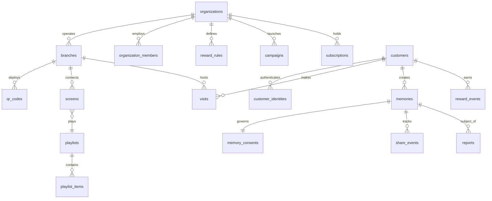

# Database Architecture & Schema Specification — Café Memories

**Database Engine:** PostgreSQL 15.8 (Supabase Cloud Managed)  
**High Availability:** Multi-AZ with Read Replicas & PgBouncer Transaction Pooler  
**Isolation Architecture:** Native Row Level Security (RLS) across all 23 domain tables  
**Scale Target:** 1,000,000+ Customers | 50,000,000+ Visit Records | 10,000,000+ Media Records  

---

## 1. Entity Relationship Overview



---

## 2. Comprehensive Relational Schema (23 Tables)

### 2.1. Multi-Tenant Core

#### `organizations`
The root commercial entity owning branches, staff, subscriptions, and global assets.
```sql
CREATE TABLE organizations (
    id UUID PRIMARY KEY DEFAULT gen_random_uuid(),
    name VARCHAR(100) NOT NULL,
    slug VARCHAR(100) UNIQUE NOT NULL,
    logo_url TEXT,
    cover_url TEXT,
    primary_color VARCHAR(32) DEFAULT '#935436',
    secondary_color VARCHAR(32) DEFAULT '#24140e',
    timezone VARCHAR(64) DEFAULT 'UTC',
    country VARCHAR(3) DEFAULT 'SAU',
    currency VARCHAR(3) DEFAULT 'SAR',
    status VARCHAR(20) DEFAULT 'active' CHECK (status IN ('active', 'suspended', 'deleted')),
    created_at TIMESTAMPTZ NOT NULL DEFAULT now(),
    updated_at TIMESTAMPTZ NOT NULL DEFAULT now()
);
```

#### `branches`
Individual physical coffee shop locations.
```sql
CREATE TABLE branches (
    id UUID PRIMARY KEY DEFAULT gen_random_uuid(),
    organization_id UUID NOT NULL REFERENCES organizations(id) ON DELETE CASCADE,
    name VARCHAR(100) NOT NULL,
    slug VARCHAR(100) NOT NULL,
    address TEXT,
    latitude DOUBLE PRECISION,
    longitude DOUBLE PRECISION,
    timezone VARCHAR(64) DEFAULT 'UTC',
    status VARCHAR(20) DEFAULT 'active' CHECK (status IN ('active', 'inactive', 'deleted')),
    created_at TIMESTAMPTZ NOT NULL DEFAULT now(),
    updated_at TIMESTAMPTZ NOT NULL DEFAULT now(),
    CONSTRAINT uq_branch_org_slug UNIQUE (organization_id, slug)
);
```

#### `organization_members`
Staff, managers, and owners with granular RBAC permissions.
```sql
CREATE TABLE organization_members (
    id UUID PRIMARY KEY DEFAULT gen_random_uuid(),
    organization_id UUID NOT NULL REFERENCES organizations(id) ON DELETE CASCADE,
    user_id UUID NOT NULL REFERENCES auth.users(id) ON DELETE CASCADE,
    role VARCHAR(20) NOT NULL CHECK (role IN ('owner', 'admin', 'manager', 'staff')),
    branch_id UUID REFERENCES branches(id) ON DELETE SET NULL,
    created_at TIMESTAMPTZ NOT NULL DEFAULT now(),
    CONSTRAINT uq_org_member UNIQUE (organization_id, user_id)
);
```

### 2.2. Customer Identity & Loyalty Core

#### `customers`
Universal customer record supporting anonymous-first progression into verified identity.
```sql
CREATE TABLE customers (
    id UUID PRIMARY KEY DEFAULT gen_random_uuid(),
    auth_user_id UUID REFERENCES auth.users(id) ON DELETE SET NULL,
    anonymous_id VARCHAR(128),
    display_name VARCHAR(100),
    email VARCHAR(255),
    avatar_url TEXT,
    created_at TIMESTAMPTZ NOT NULL DEFAULT now(),
    last_seen_at TIMESTAMPTZ NOT NULL DEFAULT now(),
    deleted_at TIMESTAMPTZ,
    CONSTRAINT chk_customer_identity CHECK (auth_user_id IS NOT NULL OR anonymous_id IS NOT NULL)
);
```

#### `customer_identities`
Maps third-party OAuth, Apple Sign-In, or Magic Links to a unified customer.
```sql
CREATE TABLE customer_identities (
    id UUID PRIMARY KEY DEFAULT gen_random_uuid(),
    customer_id UUID NOT NULL REFERENCES customers(id) ON DELETE CASCADE,
    provider VARCHAR(32) NOT NULL CHECK (provider IN ('anonymous', 'google', 'apple', 'magic_link')),
    provider_subject VARCHAR(255) NOT NULL,
    created_at TIMESTAMPTZ NOT NULL DEFAULT now(),
    CONSTRAINT uq_provider_subject UNIQUE (provider, provider_subject)
);
```

#### `qr_codes`
Physical scanning endpoints placed in venue.
```sql
CREATE TABLE qr_codes (
    id UUID PRIMARY KEY DEFAULT gen_random_uuid(),
    organization_id UUID NOT NULL REFERENCES organizations(id) ON DELETE CASCADE,
    branch_id UUID NOT NULL REFERENCES branches(id) ON DELETE CASCADE,
    slug VARCHAR(64) UNIQUE NOT NULL,
    source VARCHAR(32) DEFAULT 'table' CHECK (source IN ('table', 'counter', 'entrance', 'poster', 'receipt', 'instagram', 'campaign', 'staff', 'other')),
    label VARCHAR(100),
    is_active BOOLEAN NOT NULL DEFAULT true,
    scan_count INTEGER NOT NULL DEFAULT 0,
    created_at TIMESTAMPTZ NOT NULL DEFAULT now(),
    updated_at TIMESTAMPTZ NOT NULL DEFAULT now()
);
```

#### `visits`
High-velocity append-only visit register equipped with anti-fraud telemetry.
```sql
CREATE TABLE visits (
    id UUID PRIMARY KEY DEFAULT gen_random_uuid(),
    customer_id UUID NOT NULL REFERENCES customers(id) ON DELETE CASCADE,
    organization_id UUID NOT NULL REFERENCES organizations(id) ON DELETE CASCADE,
    branch_id UUID NOT NULL REFERENCES branches(id) ON DELETE CASCADE,
    qr_code_id UUID REFERENCES qr_codes(id) ON DELETE SET NULL,
    campaign_id UUID,
    source VARCHAR(32) DEFAULT 'qr_scan',
    verification_status VARCHAR(20) DEFAULT 'verified' CHECK (verification_status IN ('pending', 'verified', 'rejected', 'suspicious')),
    device_fingerprint VARCHAR(128),
    ip_hash VARCHAR(64),
    created_at TIMESTAMPTZ NOT NULL DEFAULT now()
);
```

### 2.3. Media, Content & Consent Core

#### `memories`
Guest photo moments and captions with moderation lifecycle.
```sql
CREATE TABLE memories (
    id UUID PRIMARY KEY DEFAULT gen_random_uuid(),
    customer_id UUID NOT NULL REFERENCES customers(id) ON DELETE CASCADE,
    organization_id UUID NOT NULL REFERENCES organizations(id) ON DELETE CASCADE,
    branch_id UUID NOT NULL REFERENCES branches(id) ON DELETE CASCADE,
    visit_id UUID REFERENCES visits(id) ON DELETE SET NULL,
    original_url TEXT NOT NULL,
    optimized_url TEXT,
    thumbnail_url TEXT,
    caption VARCHAR(280),
    status VARCHAR(20) NOT NULL DEFAULT 'pending' CHECK (status IN ('pending', 'approved', 'rejected', 'hidden', 'deleted')),
    visibility VARCHAR(20) NOT NULL DEFAULT 'live_wall' CHECK (visibility IN ('private', 'shared', 'live_wall')),
    created_at TIMESTAMPTZ NOT NULL DEFAULT now(),
    updated_at TIMESTAMPTZ NOT NULL DEFAULT now(),
    expires_at TIMESTAMPTZ,
    deleted_at TIMESTAMPTZ
);
```

#### `memory_consents`
Granular GDPR/CCPA consent declarations attached to each memory.
```sql
CREATE TABLE memory_consents (
    id UUID PRIMARY KEY DEFAULT gen_random_uuid(),
    memory_id UUID UNIQUE NOT NULL REFERENCES memories(id) ON DELETE CASCADE,
    customer_id UUID NOT NULL REFERENCES customers(id) ON DELETE CASCADE,
    save_consent BOOLEAN NOT NULL DEFAULT true,
    social_share_consent BOOLEAN NOT NULL DEFAULT false,
    live_wall_consent BOOLEAN NOT NULL DEFAULT false,
    marketing_consent BOOLEAN NOT NULL DEFAULT false,
    consent_version INTEGER NOT NULL DEFAULT 1,
    consented_at TIMESTAMPTZ NOT NULL DEFAULT now(),
    revoked_at TIMESTAMPTZ
);
```

### 2.4. Gamification & Rewards Core

#### `reward_rules`
Defines promotional rules (e.g. 5 visits = free beverage).
```sql
CREATE TABLE reward_rules (
    id UUID PRIMARY KEY DEFAULT gen_random_uuid(),
    organization_id UUID NOT NULL REFERENCES organizations(id) ON DELETE CASCADE,
    name VARCHAR(100) NOT NULL,
    description TEXT,
    trigger_type VARCHAR(32) NOT NULL CHECK (trigger_type IN ('visit_count', 'memory_count', 'social_share', 'campaign_completion', 'streak')),
    threshold INTEGER NOT NULL CHECK (threshold > 0),
    reward_type VARCHAR(32) NOT NULL CHECK (reward_type IN ('free_item', 'discount_percentage', 'fixed_discount', 'free_print', 'bonus_visit', 'custom')),
    reward_value NUMERIC(10, 2),
    reward_description TEXT,
    is_active BOOLEAN NOT NULL DEFAULT true,
    starts_at TIMESTAMPTZ NOT NULL DEFAULT now(),
    ends_at TIMESTAMPTZ,
    created_at TIMESTAMPTZ NOT NULL DEFAULT now(),
    updated_at TIMESTAMPTZ NOT NULL DEFAULT now()
);
```

#### `reward_events`
Idempotent ledger tracking points earned, unlocked, and redeemed.
```sql
CREATE TABLE reward_events (
    id UUID PRIMARY KEY DEFAULT gen_random_uuid(),
    customer_id UUID NOT NULL REFERENCES customers(id) ON DELETE CASCADE,
    organization_id UUID NOT NULL REFERENCES organizations(id) ON DELETE CASCADE,
    branch_id UUID REFERENCES branches(id) ON DELETE SET NULL,
    type VARCHAR(32) NOT NULL CHECK (type IN ('visit_earned', 'reward_unlocked', 'reward_redeemed', 'bonus_awarded', 'share_bonus')),
    value INTEGER NOT NULL DEFAULT 1,
    reference_type VARCHAR(64),
    reference_id UUID,
    idempotency_key VARCHAR(128) UNIQUE NOT NULL,
    created_at TIMESTAMPTZ NOT NULL DEFAULT now()
);
```

### 2.5. Digital Signage & TV Wall Core

#### `screens`
Physical TV display units in venues.
```sql
CREATE TABLE screens (
    id UUID PRIMARY KEY DEFAULT gen_random_uuid(),
    organization_id UUID NOT NULL REFERENCES organizations(id) ON DELETE CASCADE,
    branch_id UUID NOT NULL REFERENCES branches(id) ON DELETE CASCADE,
    name VARCHAR(100) NOT NULL,
    pairing_code VARCHAR(6),
    device_token VARCHAR(128),
    status VARCHAR(20) NOT NULL DEFAULT 'pending' CHECK (status IN ('pending', 'online', 'offline', 'paused')),
    last_heartbeat_at TIMESTAMPTZ,
    orientation VARCHAR(10) NOT NULL DEFAULT 'landscape' CHECK (orientation IN ('landscape', 'portrait')),
    resolution VARCHAR(20) DEFAULT '1920x1080',
    playlist_id UUID,
    created_at TIMESTAMPTZ NOT NULL DEFAULT now(),
    updated_at TIMESTAMPTZ NOT NULL DEFAULT now()
);
```

#### `playlists` & `playlist_items`
Controls content rotation schedules on TV walls.
```sql
CREATE TABLE playlists (
    id UUID PRIMARY KEY DEFAULT gen_random_uuid(),
    organization_id UUID NOT NULL REFERENCES organizations(id) ON DELETE CASCADE,
    branch_id UUID REFERENCES branches(id) ON DELETE SET NULL,
    name VARCHAR(100) NOT NULL,
    is_active BOOLEAN NOT NULL DEFAULT true,
    created_at TIMESTAMPTZ NOT NULL DEFAULT now(),
    updated_at TIMESTAMPTZ NOT NULL DEFAULT now()
);

CREATE TABLE playlist_items (
    id UUID PRIMARY KEY DEFAULT gen_random_uuid(),
    playlist_id UUID NOT NULL REFERENCES playlists(id) ON DELETE CASCADE,
    type VARCHAR(32) NOT NULL CHECK (type IN ('customer_memory', 'offer', 'announcement', 'product', 'logo', 'campaign')),
    content_id UUID,
    content_data JSONB,
    duration_seconds INTEGER NOT NULL DEFAULT 10,
    priority INTEGER NOT NULL DEFAULT 0,
    is_enabled BOOLEAN NOT NULL DEFAULT true,
    sort_order INTEGER NOT NULL DEFAULT 0,
    created_at TIMESTAMPTZ NOT NULL DEFAULT now()
);
```

### 2.6. Governance, Moderation & Compliance

#### `campaigns`, `reports`, `moderation_actions`, `audit_logs`, `subscriptions`, `feature_flags`, `share_events`, `notifications`
Complete administrative tables supporting enterprise compliance, multi-tenant billing, and telemetry.

### 2.7. Product Realignment Schema & Stored Procedures (Migration 00002)

#### `screen_pairing_codes`
Manages secure temporary 6-digit numeric pairing codes with a 10-minute time-to-live and brute-force attempt limits:
```sql
CREATE TABLE screen_pairing_codes (
    id UUID PRIMARY KEY DEFAULT gen_random_uuid(),
    code VARCHAR(6) NOT NULL,
    organization_id UUID NOT NULL REFERENCES organizations(id) ON DELETE CASCADE,
    branch_id UUID NOT NULL REFERENCES branches(id) ON DELETE CASCADE,
    created_at TIMESTAMPTZ NOT NULL DEFAULT now(),
    expires_at TIMESTAMPTZ NOT NULL DEFAULT (now() + INTERVAL '10 minutes'),
    is_used BOOLEAN NOT NULL DEFAULT false,
    used_at TIMESTAMPTZ,
    used_by_device_id VARCHAR(128),
    attempts INTEGER NOT NULL DEFAULT 0
);

CREATE INDEX idx_screen_pairing_lookup 
ON screen_pairing_codes (code, expires_at) 
WHERE is_used = false;
```

#### Atomic Stored Procedure: `redeem_customer_reward()`
Guarantees transactional integrity and prevents double-spending of customer rewards:
```sql
CREATE OR REPLACE FUNCTION redeem_customer_reward(
    p_customer_id UUID,
    p_organization_id UUID,
    p_branch_id UUID,
    p_rule_id UUID,
    p_idempotency_key VARCHAR
)
RETURNS JSONB
LANGUAGE plpgsql
SECURITY DEFINER
AS $$
DECLARE
    v_verified_visits INT;
    v_past_redemptions INT;
    v_threshold INT;
    v_event_id UUID;
BEGIN
    SELECT threshold INTO v_threshold FROM reward_rules WHERE id = p_rule_id;
    IF NOT FOUND THEN
        RETURN jsonb_build_object('success', false, 'error', 'Reward rule not found');
    END IF;

    SELECT COUNT(*) INTO v_verified_visits
    FROM visits
    WHERE customer_id = p_customer_id AND organization_id = p_organization_id;

    SELECT COUNT(*) INTO v_past_redemptions
    FROM reward_events
    WHERE customer_id = p_customer_id 
      AND reference_id = p_rule_id 
      AND type = 'reward_redeemed';

    IF (v_verified_visits / v_threshold) <= v_past_redemptions THEN
        RETURN jsonb_build_object('success', false, 'error', 'Insufficient visits for reward');
    END IF;

    INSERT INTO reward_events (
        customer_id, organization_id, branch_id, type, value, reference_type, reference_id, idempotency_key
    ) VALUES (
        p_customer_id, p_organization_id, p_branch_id, 'reward_redeemed', 1, 'reward_rule', p_rule_id, p_idempotency_key
    )
    RETURNING id INTO v_event_id;

    RETURN jsonb_build_object('success', true, 'event_id', v_event_id, 'redeemed_at', now());
END;
$$;
```

#### Instant Consent Cascading Trigger: `handle_consent_revocation()`
Ensures GDPR/privacy compliance: when a customer toggles off Live Wall consent, their memory visibility drops immediately to `private`:
```sql
CREATE OR REPLACE FUNCTION handle_consent_revocation()
RETURNS TRIGGER
LANGUAGE plpgsql
SECURITY DEFINER
AS $$
BEGIN
    IF (OLD.live_wall_consent = true AND NEW.live_wall_consent = false) THEN
        UPDATE memories
        SET visibility = 'private', updated_at = now()
        WHERE id = NEW.memory_id;

        INSERT INTO audit_logs (
            organization_id, action, target_type, target_id, details
        ) VALUES (
            (SELECT organization_id FROM memories WHERE id = NEW.memory_id),
            'consent_revoked_live_wall', 'memory', NEW.memory_id,
            jsonb_build_object('revoked_at', now(), 'actor', 'customer')
        );
    END IF;
    RETURN NEW;
END;
$$;

CREATE TRIGGER on_consent_revoked
AFTER UPDATE ON memory_consents
FOR EACH ROW
EXECUTE FUNCTION handle_consent_revocation();
```

---

## 3. High-Performance Indexing Strategy (1M+ Users)

To maintain sub-10ms query execution across 50,000,000+ rows, the following composite and partial B-Tree indexes are deployed:

```sql
-- Anti-fraud lookup: Rapid verification of recent visits by same customer & branch
CREATE INDEX idx_visits_antifraud 
ON visits (customer_id, branch_id, created_at DESC);

-- Fast moderation feed: Filter pending memories by branch without table scan
CREATE INDEX idx_memories_pending_moderation 
ON memories (organization_id, status, created_at DESC) 
WHERE status = 'pending';

-- Live Wall active projection: Ultra-fast retrieval of approved TV wall items
CREATE INDEX idx_memories_live_wall 
ON memories (branch_id, visibility, status, created_at DESC) 
WHERE status = 'approved' AND visibility = 'live_wall';

-- QR resolution lookup: Hash index on unique slug for O(1) resolution
CREATE INDEX idx_qr_slug_lookup 
ON qr_codes (slug) WHERE is_active = true;

-- Screen heartbeat monitoring: Find stale displays needing offline alert
CREATE INDEX idx_screens_heartbeat 
ON screens (status, last_heartbeat_at);

-- Customer identity mapping
CREATE INDEX idx_customer_identities_lookup 
ON customer_identities (provider, provider_subject);
```

---

## 4. PostgreSQL Partitioning Architecture

For append-only transaction tables that scale beyond 10M rows annually (`visits`, `memories`, `audit_logs`, `reward_events`), range partitioning by `created_at` is utilized:

```sql
-- Example Monthly Range Partitioning on visits
CREATE TABLE visits_partitioned (
    id UUID NOT NULL DEFAULT gen_random_uuid(),
    customer_id UUID NOT NULL,
    organization_id UUID NOT NULL,
    branch_id UUID NOT NULL,
    created_at TIMESTAMPTZ NOT NULL,
    PRIMARY KEY (id, created_at)
) PARTITION BY RANGE (created_at);

-- Monthly partition instance
CREATE TABLE visits_y2026m09 PARTITION OF visits_partitioned
    FOR VALUES FROM ('2026-09-01 00:00:00+00') TO ('2026-10-01 00:00:00+00');
```

This guarantees that analytical queries bounded by date ranges eliminate 90%+ of disk pages via partition pruning.
