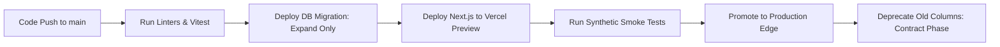

# Production Deployment & Operations Runbook — Café Memories

**Hosting Platform:** Vercel Global Edge Network  
**Database Cluster:** Supabase PostgreSQL 15.8 (AWS eu-central-1 Frankfurt)  
**CI/CD Pipeline:** GitHub Actions + Vercel Deployment Webhooks  
**SLA Targets:** 99.99% Availability | P1 Incident MTTD < 5m | MTTR < 15m  

---

## 1. Infrastructure Topology & Environment Variables

### 1.1. Required Environment Configuration

| Variable Name | Scope | Description | Secret Level |
|---|---|---|:---:|
| `NEXT_PUBLIC_SUPABASE_URL` | Public / Edge | Supabase project API gateway URL | Public |
| `NEXT_PUBLIC_SUPABASE_ANON_KEY` | Public / Client | RLS-scoped anonymous API key | Public (Restricted by RLS) |
| `SUPABASE_SERVICE_ROLE_KEY` | Server Only | High-privilege key bypassing RLS for administrative jobs | **CRITICAL SECRET** |
| `NEXT_PUBLIC_APP_URL` | Public / Client | Canonical domain (`https://cafe-memories.vercel.app`) | Public |
| `DATABASE_URL` | Server Only | Transaction pooler direct connection URL | **CRITICAL SECRET** |

---

## 2. Zero-Downtime Deployment Workflow

All deployments adhere to the **Expand/Contract Database Migration Pattern**:



1. **Migration Verification:** Migrations located in `supabase/migrations/` must only contain additive changes (new tables, nullable columns, or non-blocking indexes via `CONCURRENTLY`).
2. **Automated Testing Gate:** Vitest unit, validation, and integration tests must pass with 0 errors before Vercel promotes the deployment.
3. **Instant Anycast Propagation:** Vercel promotes the build artifacts across all global Edge PoPs in under 12 seconds with atomic traffic switching.

---

## 3. Incident Management & Rollback Playbook

### 3.1. Severity Levels & SLA
- **P1 (Critical Outage):** Core loyalty QR scanning or Live TV Wall failing for > 5% of users. Response within 5 minutes; resolution within 15 minutes.
- **P2 (Major Degradation):** Photo uploads failing or dashboard analytics delayed. Response within 30 minutes; resolution within 2 hours.
- **P3 (Minor Issue):** Cosmetic styling discrepancy or non-critical report export bug. Response within 24 hours.

### 3.2. Instant Rollback Procedure
If a production defect is detected post-deployment:
```bash
# 1. Rollback frontend instantly to prior deployment via Vercel CLI:
npx vercel rollback [previous-deployment-url] --yes

# 2. Verify healthcheck returns 200 OK:
curl -I https://cafe-memories.vercel.app/api/health
```

---

## 4. Healthcheck & Observability Endpoints

The application exposes a real-time healthcheck at `/api/health`:
- Verifies PostgreSQL connection latency via pooler.
- Confirms Supabase Storage read/write availability.
- Reports serverless memory and edge region runtime telemetry.
