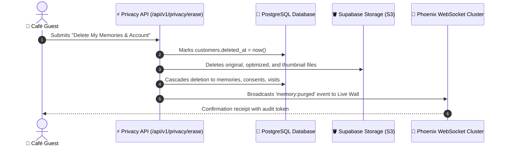

# Data Privacy & Compliance Specification — Café Memories

**Frameworks:** General Data Protection Regulation (GDPR), California Consumer Privacy Act (CCPA)  
**Principle:** Privacy by Design & Default (Article 25 GDPR)  
**Data Controller:** Merchant Organization (Café Owner)  
**Data Processor:** Café Memories Cloud Platform  

---

## 1. Data Classification Taxonomy

| Data Category | Data Elements | Storage Location | Retention Schedule | Encryption Standard |
|---|---|---|---|---|
| **Public Assets** | Café brand logo, branch name, public menu items | Supabase Storage / DB | Duration of subscription | AES-256 (At Rest), TLS 1.3 |
| **Guest Media** | Customer photo memories, captions | Supabase Storage (`memories`) | 90 days default (or customer deletion) | AES-256 (At Rest), TLS 1.3 |
| **Pseudonymous PII** | Device fingerprints, IP hashes, anonymous UUIDs | PostgreSQL (`visits`, `customers`) | 180 days rolling | SHA-256 one-way salted hash |
| **Direct PII** | Customer name, email address, avatar | PostgreSQL (`customers`, `users`) | Active lifecycle + 30-day grace period | AES-256 (At Rest), TLS 1.3 |
| **Consent Records** | Timestamped permission checkboxes | PostgreSQL (`memory_consents`) | 7 years (Audit compliance) | Immutable, Append-Only |

---

## 2. Granular Unbundled Consent Architecture

In strict accordance with GDPR Article 7, consent is never bundled or pre-selected:

```sql
-- memory_consents record structure
CREATE TABLE memory_consents (
    id UUID PRIMARY KEY DEFAULT gen_random_uuid(),
    memory_id UUID UNIQUE NOT NULL REFERENCES memories(id) ON DELETE CASCADE,
    customer_id UUID NOT NULL REFERENCES customers(id) ON DELETE CASCADE,
    save_consent BOOLEAN NOT NULL DEFAULT true,       -- Consent 1: Personal memory vault
    social_share_consent BOOLEAN NOT NULL DEFAULT false, -- Consent 2: Social media cards
    live_wall_consent BOOLEAN NOT NULL DEFAULT false,    -- Consent 3: In-venue Live TV Wall
    marketing_consent BOOLEAN NOT NULL DEFAULT false,    -- Consent 4: Promotional marketing
    consent_version INTEGER NOT NULL DEFAULT 1,
    consented_at TIMESTAMPTZ NOT NULL DEFAULT now(),
    revoked_at TIMESTAMPTZ
);
```

- If `live_wall_consent = false`, the photo is physically excluded from TV wall queries and WebSocket broadcast channels.
- If `marketing_consent = false`, the photo is hidden from merchant export tools.

---

## 3. Right to Erasure ("Right to Be Forgotten") Pipeline

Customers have the unconditional legal right to delete their photos and account history at any time:



1. **Immediate Realtime Removal:** If the memory is currently rotating on an in-venue Live TV Wall, a `memory:purged` event is emitted immediately, fading the image off the screen in < 1 second.
2. **Storage Cascade:** Background worker permanently purges all three derivative images (`original`, `optimized`, `thumbnail`) from Supabase Storage buckets.
3. **Database Anonymization:** In `visits`, the foreign key is scrubbed or pseudonymized so aggregate café foot traffic counts remain mathematically intact without containing personal references.
