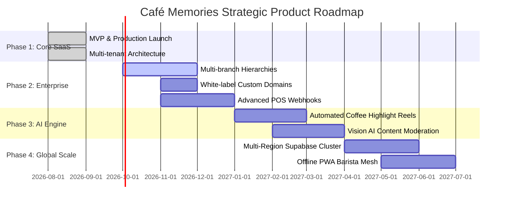

# Product & Technical Roadmap — Café Memories

**Mission:** Empower every specialty coffee roastery on Earth with an emotional digital loyalty and memory experience.  
**Planning Horizon:** 2026 – 2027  

---

## Strategic Roadmap Phases

---

### Phase 1: Production Core (Status: COMPLETE & LIVE)
- [x] Multi-tenant PostgreSQL database with 23 normalized tables and RLS.
- [x] Dynamic QR routing engine with anti-fraud hardware fingerprinting.
- [x] Mobile web customer experience with synthesized Web Audio stamp chime.
- [x] In-venue Live TV Wall with real-time WebSocket sync and Ken Burns animation.
- [x] Real-time merchant moderation dashboard with 1-click approvals.
- [x] 9:16 Instagram Story Canvas compositor.
- [x] Deployed live to Vercel Global Edge and Supabase Cloud.

---

### Phase 2: Enterprise Multi-Branch & White-Labeling (Q4 2026)
- **Custom Brand Domains:** Allow roasteries to bind custom subdomains (e.g., `memories.espressolab.com`) via Vercel Edge SSL API.
- **Staff Shift PINs:** Fast 4-digit PIN authentication for busy counter baristas sharing a single tablet.
- **Automated POS Synchronization:** Webhook integrations with Square, Toast, Clover, and Foodics to automatically issue digital stamps upon physical receipt generation.

---

### Phase 3: AI Memories & Creative Suite (Q1 2027)
- **Computer Vision Auto-Moderation:** Gemini Flash multimodal analysis to automatically detect and flag NSFW, competitors' cups, or blurry images before reaching the live queue.
- **Weekly Café Highlight Reels:** Automated ffmpeg/Gemini video compilation merging the week's top 10 customer moments into a polished reel for the café's official Instagram.

---

### Phase 4: Omnichannel Growth & Physical Printing (Q2 2027)
- **Instant Photo Booth Print Bridge:** Integration with in-venue Bluetooth/Wi-Fi receipt printers to print physical vintage monochrome sticker memories for customer laptops and journals.
- **Apple & Google Wallet Passes:** Native dynamic NFC passes that update automatically with current stamp counts and unlock rewards via Apple Pay proximity.

---

### Phase 5: Global Multi-Region Federation (Q3 2027)
- **Distributed Edge Database Replication:** Multi-region PostgreSQL read replicas in North America, Europe, Middle East, and Asia Pacific to deliver < 20ms database queries globally.
- **Offline Mesh Sync:** Local PWA barista offline caching with SQLite WASM, enabling 100% normal loyalty stamping even during full internet blackouts, auto-syncing upon reconnection.
